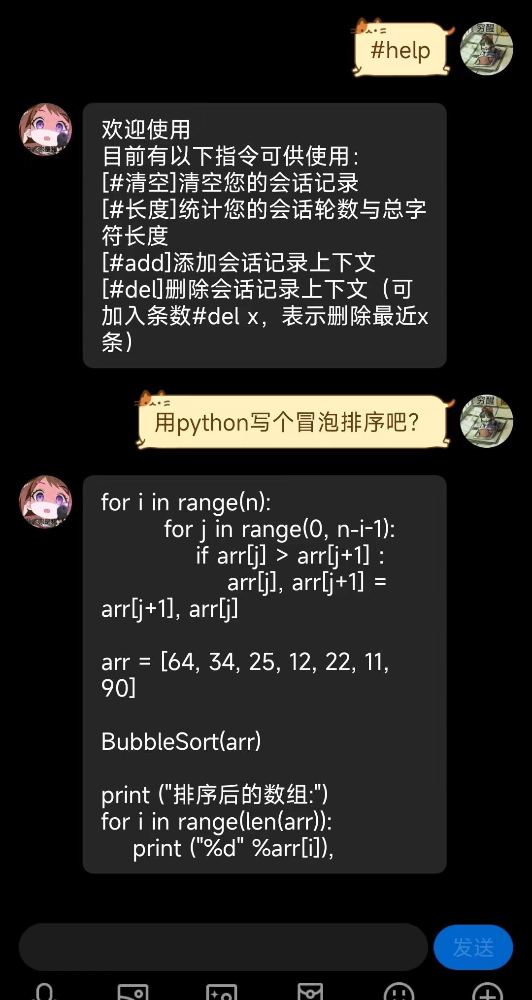
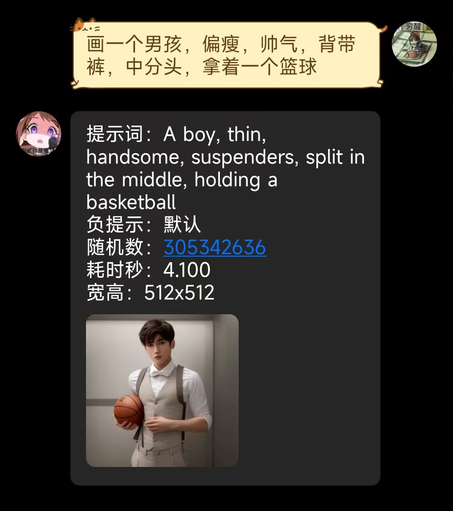
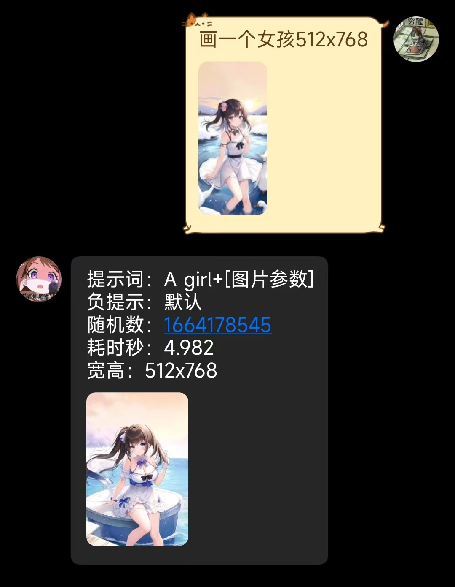

## rebase from github public
# 项目结构与说明以及目前实现
```
aichat/ #对话ai调用     openai
aiimage/#图像生成调用   diffusion
cos/    #对象存储       腾讯云cos
fanyi/  #文本翻译       有道智云
route/  #路由提供接口（比如提供给go-cqhttp转发消息）
diffusion_space.py  #扩散模型diffusion图像生成demo
config_example.yaml #配置文件示例 需要改成config.yaml运行
main.py
```

# 功能效果展示


# 接入聊天
- qq需使用 gocqhttp 配置到启动端口，参考：[go-cqhttp](https://github.com/Mrs4s/go-cqhttp)
- 微信请参考 [simple-wechaty](https://github.com/jqllxew/simple-wechaty)

# 依赖安装
#### pytorch 自己具体的环境请参考：[Pytorch](https://pytorch.org/get-started/locally/)
```bash
pip3 install torch --extra-index-url https://download.pytorch.org/whl/cu117 --proxy=xx
```
上面的cu117就是对应cuda的版本
```bash
pip3 install -r requirements.txt --proxy=xx
```
# 图像生成与配置选择
### 目前实现了两种
#### 1，使用diffusers库本地调用
默认方式，可以去抱脸选择[支持diffusers库的模型](https://huggingface.co/models?library=diffusers) \
推荐 [动漫风hakurei/waifu-diffusion](https://huggingface.co/hakurei/waifu-diffusion)
[2.5D风nuigurumi/basil_mix](https://huggingface.co/nuigurumi/basil_mix/tree/main)

#### 2，调用stable-diffusion-webui的接口
前置条件: 搭建sd-webui
- 可以参考我的另一个项目[传送门](https://github.com/jqllxew/stable-diffusion-webui)
- 也可以通过[colab方式](https://github.com/jqllxew/ai-chat/blob/master/nb/stable_diifusion_webui_AUTOMATIC1111_jqllxew.ipynb)

在配置文件config.yaml中注释掉local段落，会自动选择api实现方式，具体请参考配置文件示例config_example.yaml

# 关于解决 NSFW 问题
#### 使用diffusers库的 Pipeline对象调用模型生成通常会有这样的警告
```
Potential NSFW content was detected in one or more images. A black image will be returned instead.
Try again with a different prompt and/or seed.
```
#### 可以对该检测文件直接进行修改
```
site-packages/diffusers/pipelines/stable_diffusion/safety_checker.py
```
#### 如下方法中
```
@torch.no_grad()
def forward(self, clip_input, images):
...
# has_nsfw_concepts = [len(res["bad_concepts"]) > 0 for res in result] # 设置为空数组
has_nsfw_concepts = []
...
```