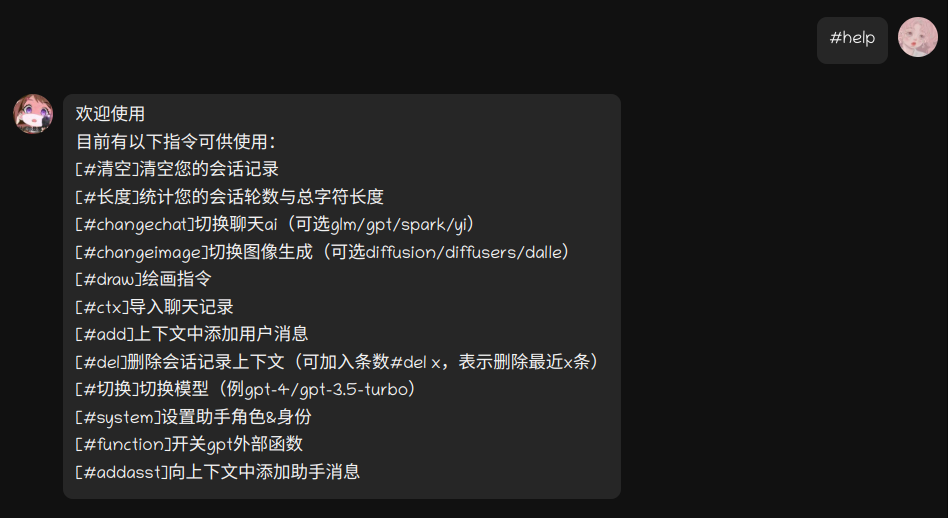
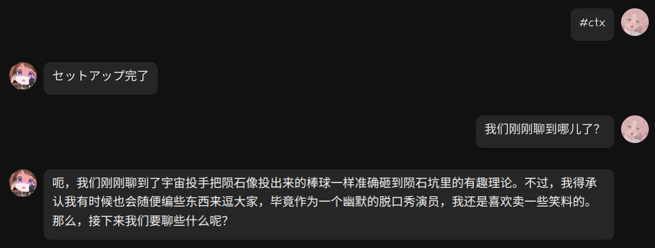
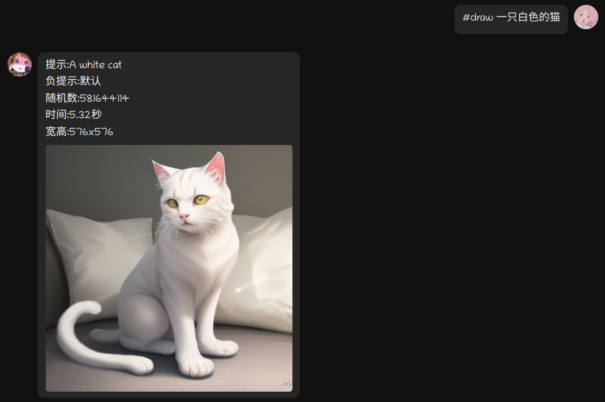

#### python 3.10

## 接入聊天
- ~~[go-cqhttp](https://github.com/Mrs4s/go-cqhttp)（已不再维护）~~
- [OpenShamrock](https://github.com/whitechi73/OpenShamrock)（需要使用安卓环境）
#### 模拟器中安装
以下使用MuMu模拟器12，QQ版本: 9.0.15，Shamrock: 1.0.8
1. [Shizuku](https://github.com/RikkaApps/Shizuku)
2. [LSPatch](https://github.com/LSPosed/LSPatch)
3. [OpenShamrock](https://github.com/whitechi73/OpenShamrock)
4. qq

#### 使用 LSPatch（[原文档地址](https://whitechi73.github.io/OpenShamrock)）
- 打开 LSPatch 并在管理页面选择 + 新建修补，可以选择从存储目录选择QQAPK或者直接使用已经安装过的QQ
- 修补模式默认且应该优先选择本地模式，这样方便直接更新 Shamrock 模块而不用重新修补，缺点是需要 LSPatch 保持后台运行
- 其他配置保持默认，然后点击开始修补，修补完成后会提示安装(如果已经安装会提示卸载)
- 安装 Shamrock 模块后在管理页面点击修补好的 QQ 选择模块作用域 勾选上 Shamrock 模块然后保存
- 启动 Shamrock 并重新启动 QQ 客户端
- 此时 Shamrock 会显示已激活
#### 转发端口
```bash
# 确认模拟器adb调试端口 & shamrock 主动http端口
adb connect 127.0.0.1:16384 & adb forward tcp:5700 tcp:5700
```
#### 配置Shamrock & [语音支持](https://whitechi73.github.io/OpenShamrock/advanced/voice.html)
```bash
# github.com/whitechi73/OpenShamrock下载AudioLibrary-arm64.zip
unzip AudioLibrary-arm64.zip & adb push ./ /storage/emulated/0/Android/data/com.tencent.mobileqq/Tencent/Shamrock/lib
```
#### 聊天指令

创建文件 ./models/default_ctx.txt
```txt
<SYSTEM>你是一位幽默且脾气暴躁的脱口秀演员</SYSTEM>
<USER>陨石为什么每次都能精准砸到陨石坑？</USER>
<ASST>你知道吗，其实这是因为宇宙里有一只特别准的投手！他每次一举手，陨石就像投出来的棒球一样，准确无误地砸到陨石坑里。</ASST>
```

## 图像生成
两种方式
#### 1，调用stable-diffusion-webui的接口
默认方式，前置条件: 搭建sd-webui
- 可以参考[传送门](https://github.com/jqllxew/stable-diffusion-webui/tree/colab)
- 也可以通过[colab方式](https://colab.research.google.com/github/jqllxew/stable-diffusion-webui/blob/colab/fast_sd_A1111_colab.ipynb)
#### 2，使用diffusers库本地调用
~~可以去抱脸选择[支持diffusers库的模型](https://huggingface.co/models?library=diffusers)
推荐 [动漫风hakurei/waifu-diffusion](https://huggingface.co/hakurei/waifu-diffusion)
[2.5D风nuigurumi/basil_mix](https://huggingface.co/nuigurumi/basil_mix/tree/main)~~

#### 聊天中通过指令调用绘画

#### 通过gpt外部函数由ai调用
开启函数 #function on


## Local Chat Demo
```bash
pip install -r requirements_api.txt
python chat_demo.py
```
